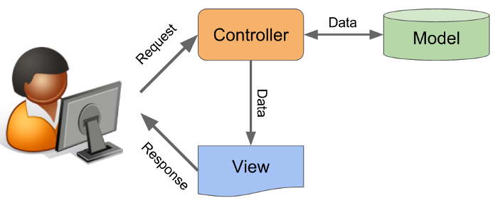

# Final Project - Front End

> Dev branch

## Introduction
The aim of this project is to create a simple service that can scrape useful data from ITJobswatch website and display the current top 30 jobs.
The app is written in Python 3 with Flask microframework. We decided to create one-page website which is divided into three sections:
- Home
- Our Team
- Top 30 Jobs

## Documentation
Requirements:
- Python 3.x+

Make sure the requirements are installed in your Python environment (or virtual environment):
```
python -m pip install -r requirements.txt
```

To run the application:
```
python app.py
```

The above command will run a localhost server on port 8000 on your machine. To view the app, open any browser and enter `127.0.0.1:8000` or `localhost:8000` as the URL.

## MVC


Parts of Model-view-controller (MVC) were used for this project, which is a software design pattern commonly used for developed user interfaces that divides the related program logic into three interconnected element.

## Structure
- The `static` folder to store stylesheets, javascript files and images.
- The `templates` folder to store the visual representation such as template HTML files.
- `app.py` file which works as the controller with Flask microframework. The app will utilize the Mode-View-Controller design pattern in the back-end to handle requests and distribute responses to the end user.

## Styles and libraries
- Style formatting has been added to the HTML structure using CSS and JS. 
- Jinja2 template library

## Environment variables
The application tries to get a data file from an S3 bucket. To get the data, the `boto3` module is used. However, the module requires some environment variables to be set in order to work correctly. Specifically:
- `AWS_ACCESS_KEY_ID`: Access key for AWS IAM role
- `AWS_SECRET_ACCESS_KEY`: Secret key for AWS IAM role
- `AWS_BUCKET`: Name of bucket in S3
- `AWS_REGION`: Region of S3 bucket
- `FILEPATH_JOBS`: Path of file in bucket


## Main functionality

Environment variable credentials were used to connect to S3 
```
s3 = boto3.client(
    's3',
    aws_access_key_id=AWS_ACCESS,
    aws_secret_access_key=AWS_SECRET,
)
```

Part of the script from `app.py` To collect data from the Aamazon S3 bucket. 
```
    data = s3_boto3.collect_data()
    return render_template("home.html", context=context, data=data)  
```