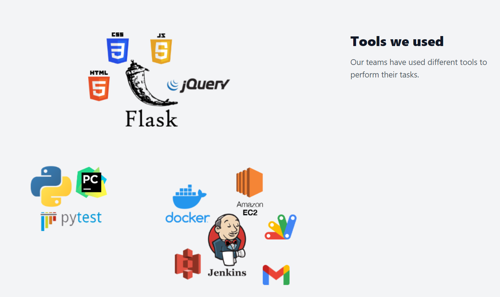
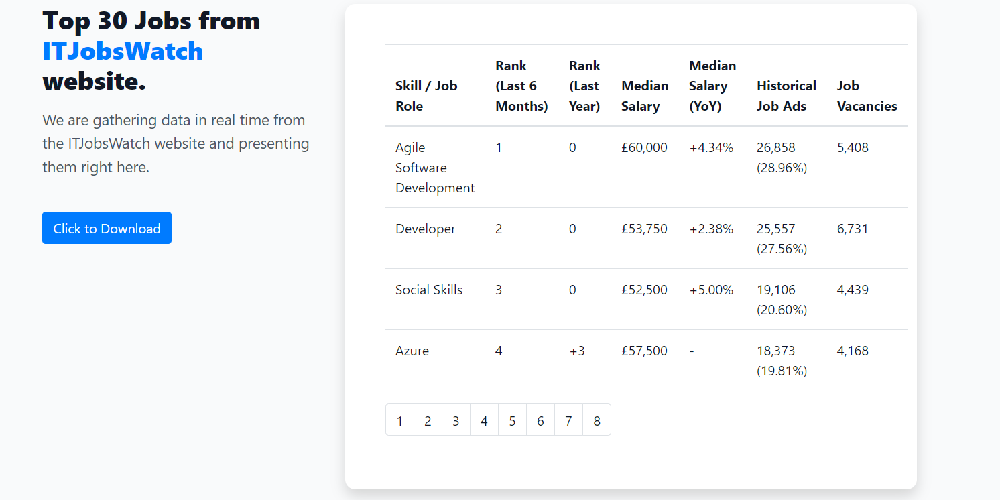

# Final Project - Front End

> Dev branch

## Introduction
The aim of this project is to create a simple service that can scrape useful data from ITJobswatch website and display the current top 30 jobs. The app is written in Python 3 with the Flask microframework. We decided to create a one-page website which is divided into four sections:
- Home
- Our Team
- Top 30 Jobs
- Tools

## Pre-Requirements:
- Python 3.x+

Make sure the requirements are installed in your Python environment (or virtual environment). To install the requirements run the command below:
```
python -m pip install -r requirements.txt
```

To run the application:
```
python app.py
```

The above command will run a localhost server on `port 8000` on your machine. To view the app, open any browser and enter `127.0.0.1:8000` or `localhost:8000` as the URL.


## Flask
- Flask is a lightweight WSGI web application framework designed to help developers get started with their web applications quickly and easily with the ability to scale up to complex applications.
- It's categorised as a microframework as it does not require particular tools or libraries to function.

## MVC


Parts of Model-view-controller (MVC) were used for this project, which is a software design pattern commonly used for developed user interfaces that divides the related program logic into three interconnected element.

## Structure
- The `static` folder to store style sheets, JavaScript files and images.
- The `templates` folder to store the visual representation such as template HTML files.
- `app.py` file which works as the controller with Flask microframework. The app will utilize the Model-View-Controller design pattern in the back-end to handle requests and distribute responses to the end user. There is also a `data_colector.py` file which collects CSV file from an Amazon S3 bucket. 

## Styles and libraries
- Style formatting has been added to the HTML structure using CSS and JS
- Jinja2 template library

## Main functionality
- Part of `data_collector.py` code which collects the CSV file from the S3 bucket
- It will raise an error if the file is not found
```
def collect_data_url():
    s3_request = requests.get(S3_FILE_URL)

    if s3_request: 
        s3_content = s3_request.content.decode('utf-8')
        reader = csv.reader(s3_content.splitlines(), delimiter=',')
        context = list(reader)[0:30]
    else:
        context = "The file can't be located in the S3 bucket, or permissions denied."
    return context
```


Part of the script from `app.py` to collect data from the Amazon S3 bucket. 
```
data = data_collector.collect_data_url()
return render_template("home.html", context=list(team.team.values()), data=data)
```

## Our Website
Tools we used for this project, separated into three groups, each team used a different tool set.   



The IT Jobs section, which displays current top 30 IT Jobs from the ITJobsWatch website.   


